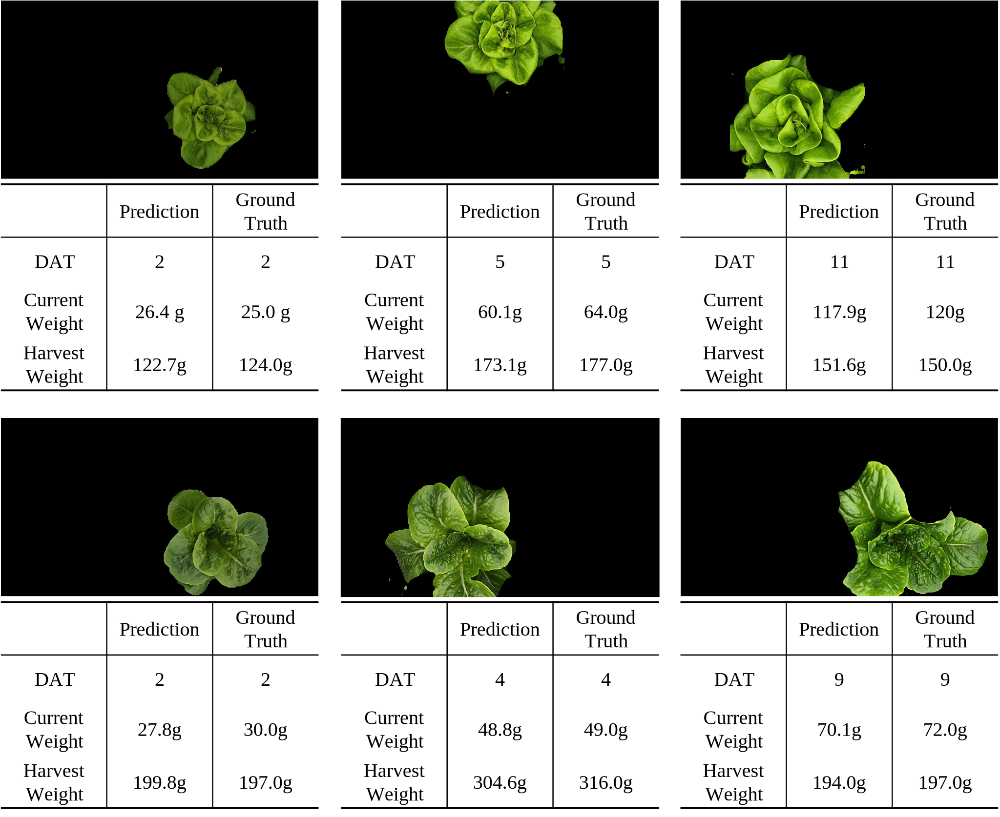

# FLAsH
FastSAM-Based Lettuce Analysis for High-Density Cultivation

FLAsH is an end-to-end computer vision framework for analyzing lettuce growth in high-density smart farm environments.  
The framework performs instance segmentation and plant-level growth prediction from RGB images.

## Framework

  

## Overview

FLAsH consists of two main stages:

1. **Instance Segmentation**
   - Fine-tuned FastSAM for plant-level segmentation
   - Handles dense lettuce layouts with severe leaf overlap

2. **Growth Prediction**
   - CNN-based regression models
   - Predicts:
     - Days After Transplanting (DAT)
     - Current Weight
     - Harvest Weight

## Results

- Instance segmentation performance: **mAP = 0.788**
- Growth prediction accuracy: **MAPE < 10%**
- 6 lettuce datasets evaluated in real smart farm environments

## Example

  

  

## Citation

If you use this work, please cite:

@article{flash2026,
  title={FLAsH: FastSAM-Based Lettuce Analysis for High-Density Cultivation},
  author={Lee, Hyeseung and Kim, Sungsu and Kim, Seoung Bum},
  year={2026}
}
